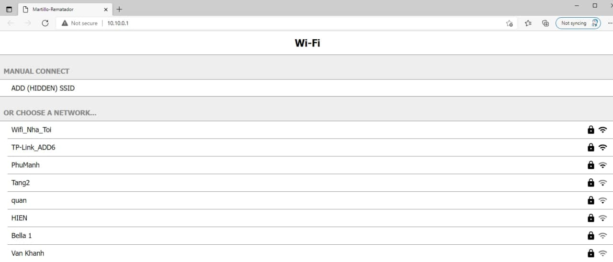
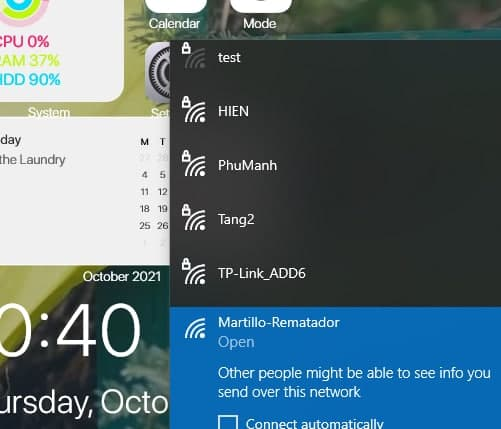
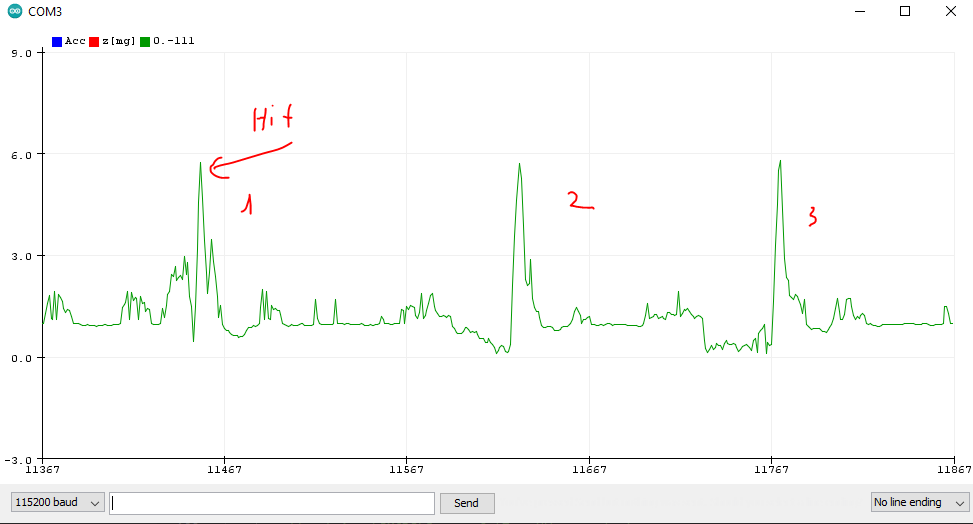

# Smart hammer

This project will read data as : accelerometer and buttons and push add to AWS
* build in ESP32-IDF

#How to config wifi connect to your AP  
  
  
#How to detect hit using Z axis  

